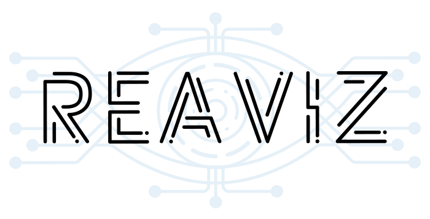

  

---

- Getting Started
  - [Why](getting-started/why.md)
  - [Installing](getting-started/installing.md)
  - [Developing](getting-started/developing.md)
  - [CSS Variables](getting-started/css-vars.md)
- Chart Types
  - [Area Chart](charts/area-chart.md)
  - [Bar Chart](charts/bar-chart.md)
  - [Line Chart](charts/line-chart.md)
  - [Map](charts/map.md)
  - [Pie Chart](charts/pie-chart.md)
  - [Sparklines](charts/sparklines.md)
  - Hive Plot
  - Sankey Chart
  - Scatter Plot
  - Bubble Chart
- Utilities
  - Brush
  - Pan Zoom
  - Axis
  - Legends
  - Gridlines
  - Tooltips
  - Markline
- Advanced
  - [Creating Custom Charts](advanced/custom-charts.md)
  - [Animations](advanced/animations.md)
- [Contributing](CONTRIBUTING.md)
- [License](https://github.com/jask-oss/reaviz/blob/master/LICENSE)
- [Changelog](https://github.com/jask-oss/reaviz/blob/master/CHANGELOG.md)
